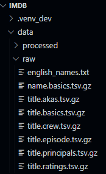
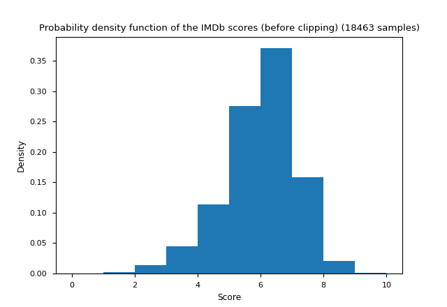
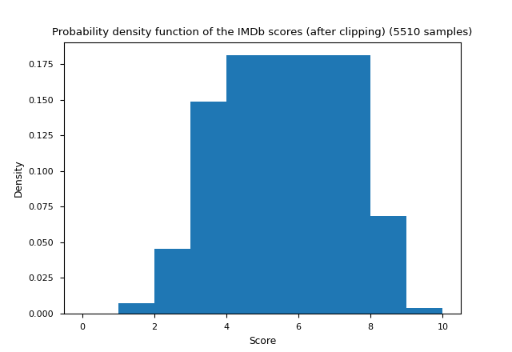
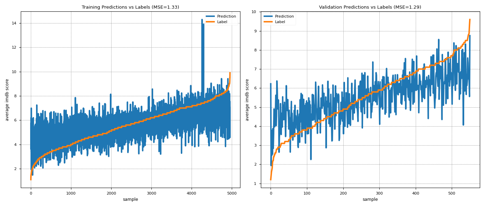
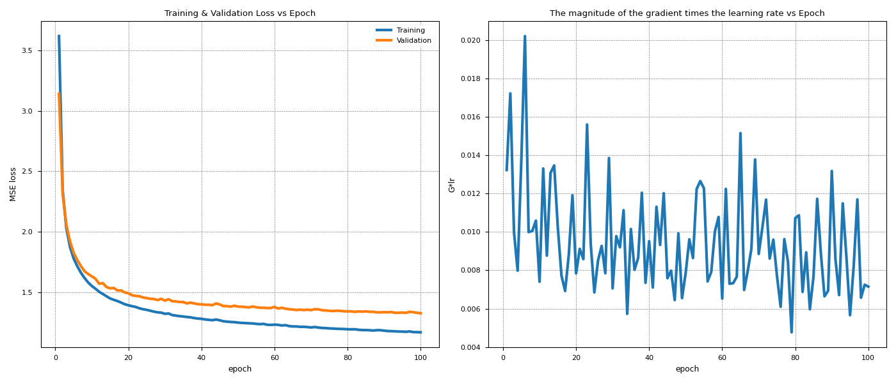
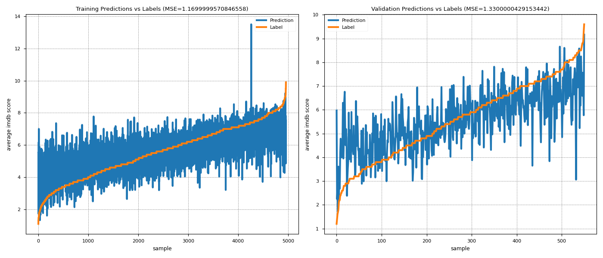

# About The Project
The goal was to build a model to predict the IMDb scores of movies before they are released, meaning I can only use features that are available to the public before the release. For that purpose, I used [the IMDb dataset](https://www.imdb.com/interfaces/). 

This work can be improved by adding in more features to the dataset. I will discuss this further in [Results](#Results).

## More on the Datasets
I used the IMDb dataset ([doc](https://www.imdb.com/interfaces/), [data](https://datasets.imdbws.com/)) as the main source of data. From this dataset, I extracted:
* Unique ID numbers for each movies.
* The release year of the movie
* The genres of the movie
* Information about the ages of the cast at the time of the release date.
* Information about the IMDb scores of the cast at the time of the release date.
* The IMDb score as the label

I also used a name database ([GitHub](https://github.com/smashew/NameDatabases)) to filter out non-English movies.

## <a name="ProcessingtheData"></a> Processing the Data
The data is extracted from the IMDB dataset by the filters. Filters run consequtively, and they require the output of the previous filter. Other than that, each filter works independently. There are in total 10 filters. The source code of each filter is stored in 'source\data_processing', and the output of each filter is stored in 'data\processed'.

The final data is stored as 'dataset.csv' (also as .npy and .pt) in 'data\processed'. 

## Machine Learning Methods
Takes the processed dataset as the input, and outputs results.

### Processing the data further
The data is processed further. The reason this isn't handled in [Processing the Data](#ProcessingtheData) is that there are some parameters in this section that we might want to change depending on the results we get, such as the number of components in the Kernal PCA. Here are the steps taken:
* Some data is eliminated so that we have a more balanced distribution.
* Standardization
* Dimensionality reduction with [Kernel PCA](https://scikit-learn.org/stable/auto_examples/decomposition/plot_kernel_pca.html). It is disabled. To activate it, just uncomment the following lines in 'source\machine_learning_c1_prepare_data.py':
```python
73    pca_model = KernelPCA(n_components=5, kernel='rbf')
74    pca_model.fit(training_data)
75    training_data = pca_model.transform(training_data)
76    validation_data = pca_model.transform(validation_data)
```
* Cache the final data in 'source\machine_learning\cache'.

### Linear Regression
A simple linear regression model with L2 regularization.  It uses the data in the cache. Lambda for L2 regularization is the only hyperparameter, but changing it doesn't seem to have a big effect. It is located in 'source\machine_learning\c2_liner_regression.py'.

### Neural Network
A simple neural network model. The model source code is located in 'source\machine_learning\c3_neural_network.py', and the training source code is located in 'source\machine_learning\c4_neural_network.py'. Here are the hyperparameters:
* Learning rate
* Lambda (L2 regularization)
* Batch size
* Number of epochs
* 'startOver' parameter to decide whether to start training over, or continue traning from the last trained model.


# Requirements
See 'requirements.txt'. Python version used: 3.10.3

You should download [every IMDb datasets](https://datasets.imdbws.com/) into 'data\raw' as in the screenshot below.

You sould also download [English names](https://github.com/smashew/NameDatabases/blob/master/NamesDatabases/first%20names/us.txt) into 'data\raw' and change its name to 'english_names.txt' as in the screenshot below.



# Usage
Run 'source\main.py'. Here are couple of adjustments you can do to main.py:
* Comment as follows to skip data processing. It takes too much time, and the last processed data is already in the repository:
  'source\machine_learning_c1_prepare_data.py':
```python
44    if __name__ == "__main__":
45        #data_processing()
46        machine_learning()(validation_data)
```
* Comment as follows to skip further data processing. The cached data is already in the repository:
  'source\machine_learning_c1_prepare_data.py':
```python
38    #ml.prepare_data()
```
* Adjust the hyperparameters:
  'source\machine_learning_c1_prepare_data.py':
```python
40    ml.neural_network(startOver=True, learning_rate=0.001, 
41                      lamb_regularization_parameter=0.001, 
42                      batch_size=32, number_of_epochs=100)
```

# <a name="Results"></a> Results
## Data:





## Linear Regression:



It should be noted that the data is sorted after the results were taken. This is done to see if linear regression can really capture the structure in tha data. The error on the traning dataset represents the bias, while the error on the validation dataset on top of that bias error represents the variance. 

We can see that the model have high bias, because it cannot fit to the tarining data. However, it has a very low variance, because it can fit to the validation data as good as it can fit to the training data.

To try to solve the bias problem, we can implement a different model with higher complexity. However, the bias might be due to the fact that there isn't enough information in the data to correctly predict the imdb scores of the movies.

## Neural Network:





We get very similar results. We might improve the performance a little, but it doesn't seem like we can go below MSE=1. The problem seems to be that we don't have enough information, which makes sense. There are many important factors that affect the IMDb score, but not included in our dataset.

# Contact
email: kaan.buyukdemirci@ug.bilkent.edu.tr

secondary email: kaan.buyukdemirci2023@gmail.com

# License
[](https://opensource.org/licenses/MIT)